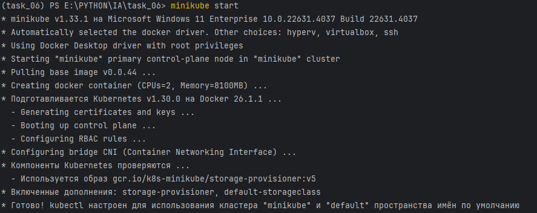
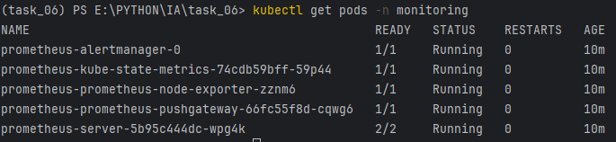
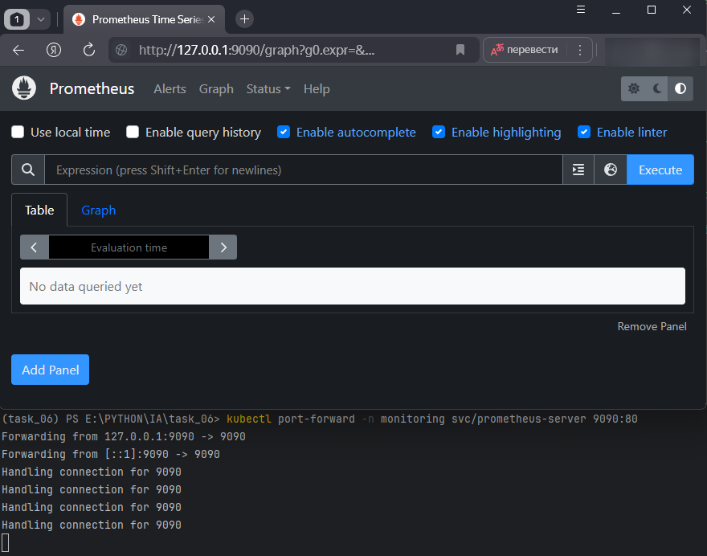
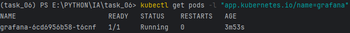
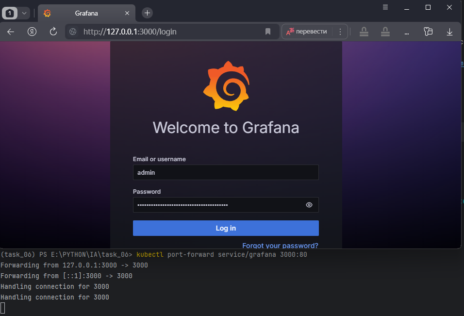
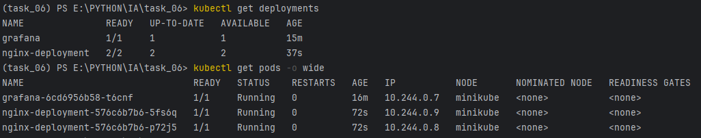
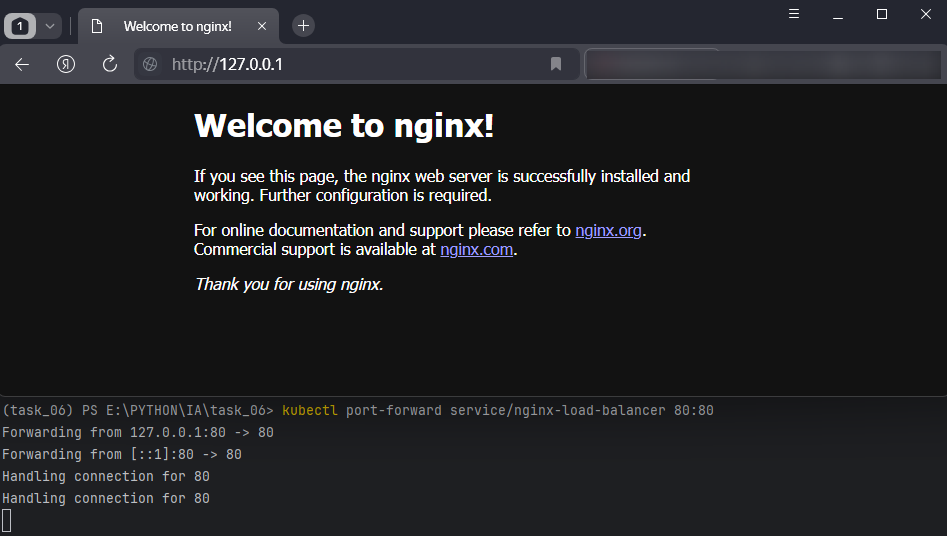
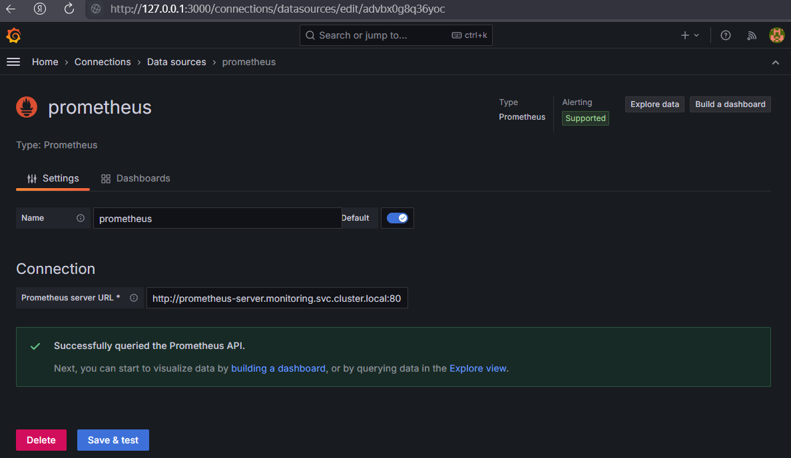
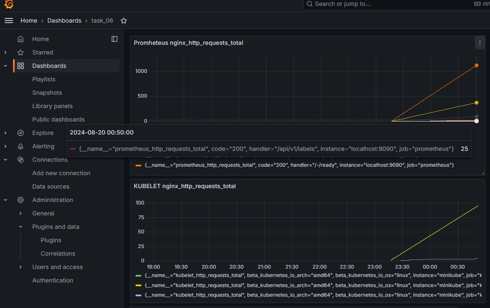
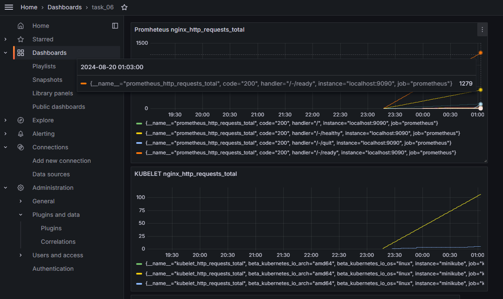

# Итоговая аттестация Задание 6.


## Мониторинг приложения в Minikube с использованием Prometheus и Grafana

## Цель:
Научиться настраивать мониторинг Kubernetes-кластера и приложений с использованием Prometheus и Grafana в среде Minikube.

## Описание задания:
- Запустите Minikube, если он еще не запущен.
- Установите Prometheus с использованием Helm.
- Установите Grafana с использованием Helm.
- Создайте простое приложение на основе Nginx.
- Убедитесь, что приложение работает, вызвав его через minikube service.
- Добавьте в Grafana источник данных.
- Сделайте метрику nginx_http_requests_total.

## Результат задания
После выполнения задания у Вас будет развернутый в Minikube мониторинг с использованием Prometheus и Grafana. Вы сможете наблюдать за работой вашего приложения, настраивать сбор метрик и визуализировать их в Grafana.

В качестве решения необходимо сделать отчет, в котором видны обращения через port-forwarding, и это же количество видно в Grafana.

## Выполнение
- Запустите Minikube, если он еще не запущен. 
  - ```minikube start```
  - ```kubectl cluster-info```
  - Kubernetes control plane is running at https://127.0.0.1:62122

  

- Установите Prometheus с использованием Helm.
  - ```helm repo add prometheus-community https://prometheus-community.github.io/helm-charts```
  - создадим namespace под Prometheus ```kubectl create namespace monitoring```
  - ```helm install prometheus prometheus-community/prometheus --namespace monitoring```
  - <details>
      <summary>Информация после установки</summary>
      NAME: prometheus LAST DEPLOYED: Mon Aug 19 23:15:07 2024
      NAMESPACE: monitoring STATUS: deployed REVISION: 1 TEST SUITE: None
      NOTES:
      The Prometheus server can be accessed via port 80 on the following DNS name from within your cluster: prometheus-server.monitoring.svc.cluster.local
    
      Prometheus server URL: prometheus-server-5b95c444dc-wpg4k
        kubectl --namespace monitoring port-forward $POD_NAME 9090
  
      The Prometheus alertmanager can be accessed via port 9093 on the following DNS name from within your cluster: prometheus-alertmanager.monitoring.svc.cluster.local

      Alertmanager URL: prometheus-alertmanager-0
        kubectl --namespace monitoring port-forward $POD_NAME 9093

      The Prometheus PushGateway can be accessed via port 9091 on the following DNS name from within your cluster: prometheus-prometheus-pushgateway.monitoring.svc.cluster.local

      Get the PushGateway URL by running these commands in the same shell:

      export POD_NAME=$(kubectl get pods --namespace monitoring -l "app=prometheus-pushgateway,component=pushgateway" -o jsonpath="{.items[0].metadata.name}")
      
      kubectl --namespace monitoring port-forward $POD_NAME 9091
    </details>
  - Посмотрим, развернулся ли Prometheus: ```kubectl get pods -n monitoring```

  
  - Настроим порт-форвардинг для доступа к интерфейсу Prometheus: ```kubectl port-forward -n monitoring svc/prometheus-server 9090:80```

  

- Установите Grafana с использованием Helm.
  - Добавляем репозиторий grafana: ```helm repo add grafana https://grafana.github.io/helm-charts```
  - Обновляемся: ```helm repo update```
  - Устанавливаем: ```helm install grafana grafana/grafana```
  - <details>
      <summary>Информация после установки</summary>
      NAME: grafana LAST DEPLOYED: Mon Aug 19 23:30:37 2024
      NAMESPACE: default STATUS: deployed REVISION: 1
      NOTES:
      Get your 'admin' user password by running: ```kubectl get secret --namespace default grafana -o jsonpath="{.data.admin-password}" | base64 --decode``` -> CrWs7wMf2E0AQbQI6F1nH9iXej9WAymp7agHDx3O
    
      The Grafana server can be accessed via port 80 on the following DNS name from within your cluster: grafana.default.svc.cluster.local
  
      Get the Grafana URL to visit by running these commands in the same shell: grafana-6cd6956b58-t6cnf

      kubectl --namespace default port-forward grafana-6cd6956b58-t6cnf 3000
    </details>
  - ```kubectl get pods -l "app.kubernetes.io/name=grafana"```

  
  - ```kubectl port-forward service/grafana 3000:80```

  

- Создадим простое приложение(nginx-app.yaml) на основе Nginx.
  - ```kubectl apply -f .\nginx-app.yaml```
  
  
  - Сделаем сервис(loadBalancer.yaml) доступным для просмотра в браузере ```kubectl apply -f load-balancer.yaml```

- Убедитесь, что приложение работает, вызвав его через minikube service.
  

- Добавьте в Grafana источник данных.
  - Настроим соединение в Graphana с Prometheus ```http://prometheus-server.monitoring.svc.cluster.local:80```
   

- Сделайте метрику nginx_http_requests_total.
  - Создадим нагрузку bat файлом (/loads/curl.bat) 
  
  
